# 📈 Stock Trading Platform

### CodeAlpha Java Programming Internship - Task 2

**Version:** 1.0

A Java console-based Stock Trading Platform that simulates a real-world stock trading environment. The application
enables users to buy and sell stocks, manage an investment portfolio, monitor portfolio performance, and maintain
transaction history with persistent data storage using Java file handling.

---

## Project Overview

The **Stock Trading Platform** is a menu-driven Java application developed to demonstrate practical implementation of
Object-Oriented Programming (OOP) concepts through a realistic financial simulation.

The application allows users to:

- Buy and sell stocks
- Manage an investment portfolio
- View current market prices
- Monitor portfolio performance
- Maintain transaction history
- Save and restore data automatically
- Experience a clean and professional console interface

This project was developed as part of the **CodeAlpha Java Programming Internship** and emphasizes clean code, modular
architecture, exception handling, collections, and file handling.

---

## Project Information

| Property             | Details                               |
|----------------------|---------------------------------------|
| Project Name         | Stock Trading Platform                |
| Version              | 1.0                                   |
| Internship           | CodeAlpha Java Programming Internship |
| Task                 | Task 2                                |
| Programming Language | Java                                  |
| IDE                  | IntelliJ IDEA                         |
| Application Type     | Console Application                   |
| Programming Paradigm | Object-Oriented Programming (OOP)     |
| Data Storage         | Text Files                            |
| Current Status       | ✅ Completed                           |

---

## Key Features

### Stock Market

- View all available stocks
- Display company names
- Display stock prices
- Simulate market price fluctuations

### Trading

- Buy stocks
- Sell stocks
- Validate stock symbols
- Validate share quantity
- Check account balance before purchase

### Portfolio Management

- Display owned stocks
- Display share quantities
- Display current market prices
- Calculate total portfolio value

### Portfolio Performance

- Calculate total investment
- Calculate current portfolio value
- Calculate profit or loss

### Transaction History

- Record BUY transactions
- Record SELL transactions
- Store transaction timestamps
- Display formatted transaction history

### Persistent Storage

The application automatically stores:

- User Information
- Portfolio Holdings
- Transaction History

using Java File Handling so that all data is restored when the application is launched again.

### Input Validation

The application validates:

- Invalid menu selections
- Invalid stock symbols
- Invalid numeric input
- Negative quantities
- Insufficient balance
- File handling exceptions

---

## Technologies Used

| Technology                  | Purpose                   |
|-----------------------------|---------------------------|
| Java                        | Core Programming Language |
| Object-Oriented Programming | Software Design           |
| Collections Framework       | Portfolio Management      |
| File Handling               | Persistent Data Storage   |
| Exception Handling          | Input Validation          |
| IntelliJ IDEA               | Development Environment   |
| Git                         | Version Control           |
| GitHub                      | Source Code Hosting       |

---

## Version History

### Version 1.0

**Initial Release**

Implemented features include:

- Stock Market Simulation
- Buy Stocks
- Sell Stocks
- Portfolio Management
- Portfolio Performance Analysis
- Transaction History
- Persistent File Storage
- Professional Console Interface
- Exception Handling
- Input Validation

> **Version 1.0** is the official CodeAlpha internship submission. Future enhancements will be developed separately
> under Version 2.0 while preserving Version 1.0 as the stable release.

---

# Project Structure

```
StockTradingPlatform/
│
├── src/
│   ├── Main.java
│   ├── ConsoleUI.java
│   ├── Market.java
│   ├── Stock.java
│   ├── Portfolio.java
│   ├── User.java
│   ├── Transaction.java
│   └── FileManager.java
│
├── data/
│   ├── user.txt
│   ├── portfolio.txt
│   └── transactions.txt
│
├── README.md
├── LICENSE
└── .gitignore
```

---

# Application Architecture

The application follows a modular Object-Oriented Programming (OOP) design where each class has a single, well-defined
responsibility.

```
                     +------------------+
                     |      Main        |
                     |------------------|
                     | Menu Controller  |
                     +---------+--------+
                               |
      ---------------------------------------------------
      |               |               |                 |
      ▼               ▼               ▼                 ▼
+-------------+  +-------------+  +-------------+  +-------------+
|   Market    |  |    User     |  | ConsoleUI   |  | FileManager |
+-------------+  +-------------+  +-------------+  +-------------+
       |                |
       ▼                ▼
 +-------------+   +-------------+
 |    Stock    |   |  Portfolio  |
 +-------------+   +-------------+
                         |
                         ▼
                  +-------------+
                  | Transaction |
                  +-------------+
```

---

# Class Responsibilities

## Main.java

Acts as the application's controller.

**Responsibilities**

- Starts the application
- Displays the main menu
- Processes user input
- Invokes business logic
- Coordinates communication between classes

---

## ConsoleUI.java

Responsible for improving the console appearance.

**Responsibilities**

- Display titles
- Print separators
- Improve readability
- Provide a consistent user interface

---

## Market.java

Represents the simulated stock market.

**Responsibilities**

- Store available stocks
- Display market information
- Search stocks by symbol
- Update stock prices
- Provide current market prices

---

## Stock.java

Represents an individual stock.

**Responsibilities**

- Store stock information
- Store current market price
- Update stock price
- Display stock details

---

## User.java

Represents the investor using the application.

**Responsibilities**

- Maintain account balance
- Buy stocks
- Sell stocks
- Maintain transaction history
- Display balance
- Display portfolio performance

---

## Portfolio.java

Stores all purchased stocks.

**Responsibilities**

- Add purchased shares
- Remove sold shares
- Maintain stock holdings
- Calculate portfolio value
- Display portfolio

---

## Transaction.java

Represents an individual trading operation.

**Responsibilities**

- Store BUY transactions
- Store SELL transactions
- Store timestamps
- Calculate transaction amount
- Display transaction details

---

## FileManager.java

Handles persistent storage.

**Responsibilities**

- Save user data
- Load user data
- Save portfolio
- Load portfolio
- Save transaction history
- Load transaction history

---

# Object-Oriented Programming Concepts

The project demonstrates the following Object-Oriented Programming principles.

## Encapsulation

Each class stores its own data using private fields while providing controlled access through public methods.

Examples:

- Stock
- User
- Portfolio
- Transaction

---

## Abstraction

Each class exposes only the operations required by other classes while hiding internal implementation details.

Examples:

- buyStock()
- sellStock()
- updateMarketPrices()
- savePortfolio()

---

## Modularity

The project separates responsibilities into multiple independent classes, making the application easier to maintain,
test, and extend.

---

## Reusability

Several classes are reusable throughout the application.

Examples include:

- ConsoleUI
- FileManager
- Transaction

---

## Data Flow

The overall application workflow is illustrated below.

```
Application Starts
        │
        ▼
Load Saved Data
        │
        ▼
Display Main Menu
        │
        ▼
User Selects Operation
        │
        ├──────────────► View Market
        │
        ├──────────────► Buy Stock
        │
        ├──────────────► Sell Stock
        │
        ├──────────────► View Portfolio
        │
        ├──────────────► Portfolio Performance
        │
        ├──────────────► Transaction History
        │
        └──────────────► Exit
                           │
                           ▼
                  Save User Data
                           │
                           ▼
                    Application Ends
```

---

# System Requirements

Before running the project, ensure the following software is installed.

| Software                   | Version                              |
|----------------------------|--------------------------------------|
| Java Development Kit (JDK) | 17 or above (Developed using JDK 25) |
| IntelliJ IDEA              | Community or Ultimate Edition        |
| Git                        | Latest Version (Optional)            |

---

# Installation

## Option 1: Clone from GitHub

```bash
git clone https://github.com/Zurika9/CodeAlpha-Internship-Projects.git
```

Navigate to:

```text
Task-2/
    └── StockTradingPlatform/
```

Open the project using IntelliJ IDEA.

---

## Option 2: Download ZIP

1. Download the repository as a ZIP file.
2. Extract the contents.
3. Open the **StockTradingPlatform** folder in IntelliJ IDEA.
4. Configure the Project SDK if required.
5. Run `Main.java`.

---

# Running the Application

1. Open the project in IntelliJ IDEA.
2. Ensure the correct JDK is selected.
3. Run `Main.java`.
4. The main menu will appear.

Example:

```text
==============================================================
             STOCK TRADING PLATFORM
==============================================================

1. View Market Stocks
2. Buy Stock
3. Sell Stock
4. View Portfolio
5. View Portfolio Performance
6. View Balance
7. View Transaction History
8. Update Market Prices
9. Exit
--------------------------------------------------------------
Enter your choice:
```

---

# Application Workflow

The application follows the workflow below.

```
Start Application
        │
        ▼
Load Saved User Data
        │
        ▼
Display Main Menu
        │
        ▼
User Chooses an Option
        │
        ├── View Market Stocks
        ├── Buy Stocks
        ├── Sell Stocks
        ├── View Portfolio
        ├── Portfolio Performance
        ├── View Balance
        ├── Transaction History
        ├── Update Market Prices
        └── Exit
                │
                ▼
Save All Data
                │
                ▼
Application Ends
```

---

# Data Persistence

The application automatically creates a **data** directory (if it does not already exist) and stores the following
files.

| File               | Purpose                             |
|--------------------|-------------------------------------|
| `user.txt`         | Stores user information and balance |
| `portfolio.txt`    | Stores owned shares                 |
| `transactions.txt` | Stores transaction history          |

The stored data is automatically loaded when the application starts again.

---

# Input Validation

The application includes robust validation to improve reliability and user experience.

The following situations are handled gracefully:

- Invalid menu selection
- Invalid stock symbol
- Invalid quantity
- Negative values
- Non-numeric input
- Insufficient balance
- Selling more shares than owned
- Missing data files
- File handling exceptions

---

# Error Handling

Exception handling has been implemented throughout the project to prevent unexpected program termination.

Examples include:

- `InputMismatchException`
- `IOException`
- Number parsing exceptions
- File loading errors

Whenever possible, the application displays user-friendly error messages instead of terminating abruptly.

---

# Testing Checklist

The following features were tested during development.

| Test Case             | Status   |
|-----------------------|----------|
| View Market Stocks    | ✅ Passed |
| Buy Stocks            | ✅ Passed |
| Sell Stocks           | ✅ Passed |
| Portfolio Management  | ✅ Passed |
| Portfolio Performance | ✅ Passed |
| Balance Display       | ✅ Passed |
| Transaction History   | ✅ Passed |
| Market Price Update   | ✅ Passed |
| Data Persistence      | ✅ Passed |
| Exception Handling    | ✅ Passed |

---

# Sample User Scenario

A typical usage scenario is shown below.

1. Launch the application.
2. View available market stocks.
3. Buy shares of a selected company.
4. View the updated portfolio.
5. Monitor portfolio performance.
6. Sell selected shares.
7. Review transaction history.
8. Exit the application.
9. Restart the application to verify that data has been restored successfully.

This demonstrates the complete lifecycle of a trading session using the application.

---

# Screenshots

The following screenshots demonstrate the major features of the Stock Trading Platform.

---

## 1. Main Menu

Displays the main navigation menu.

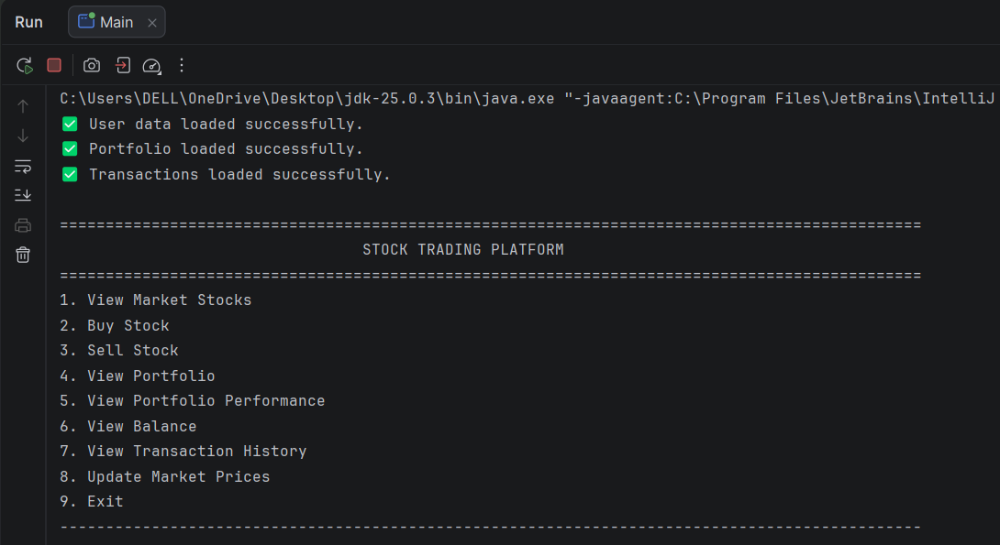

---

## 2. Market Stocks

Displays all available stocks and their current market prices.

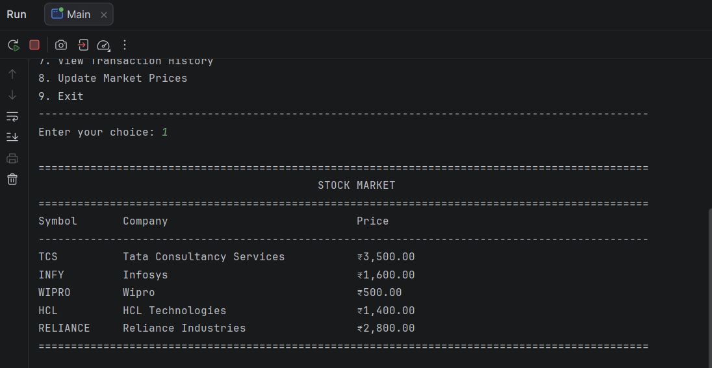

---

## 3. Buying Stocks

Illustrates a successful stock purchase.

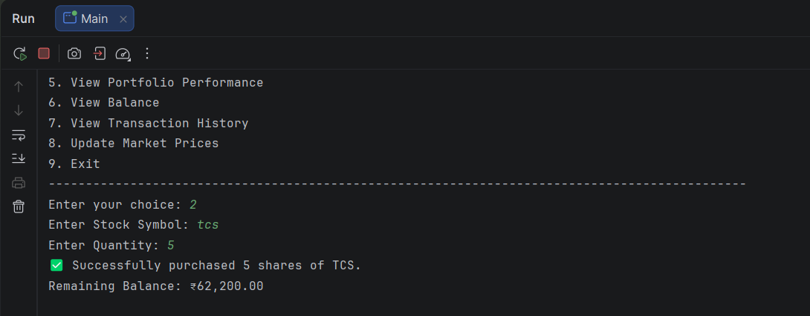

---

## 4. Selling Stocks

Illustrates a successful stock sale.

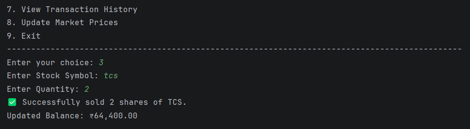

---

## 5. Portfolio

Displays owned stocks, quantities, prices, and total portfolio value.

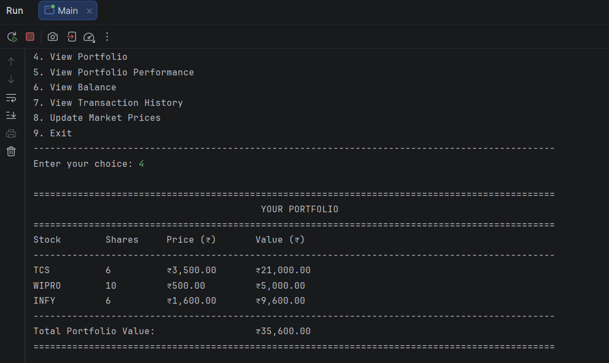

---

## 6. Portfolio Performance

Displays investment amount, current value, and profit or loss.

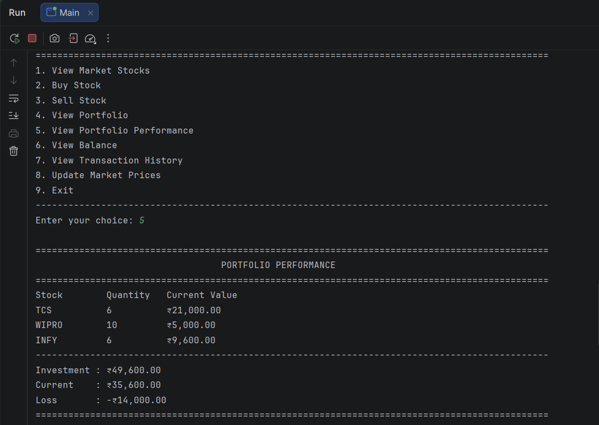

---

## 7. Account Balance

Displays the available account balance.

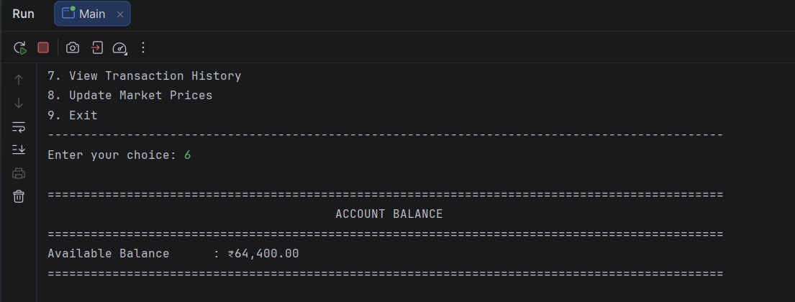

---

## 8. Transaction History

Displays the complete transaction history with timestamps.

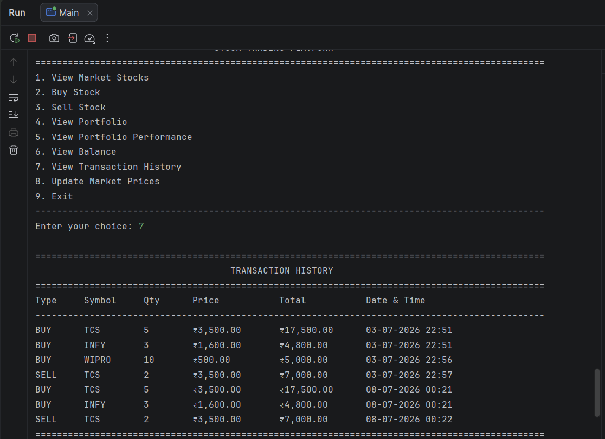

---

## 9. Automatic Data Loading

Shows successful loading of previously saved user data.

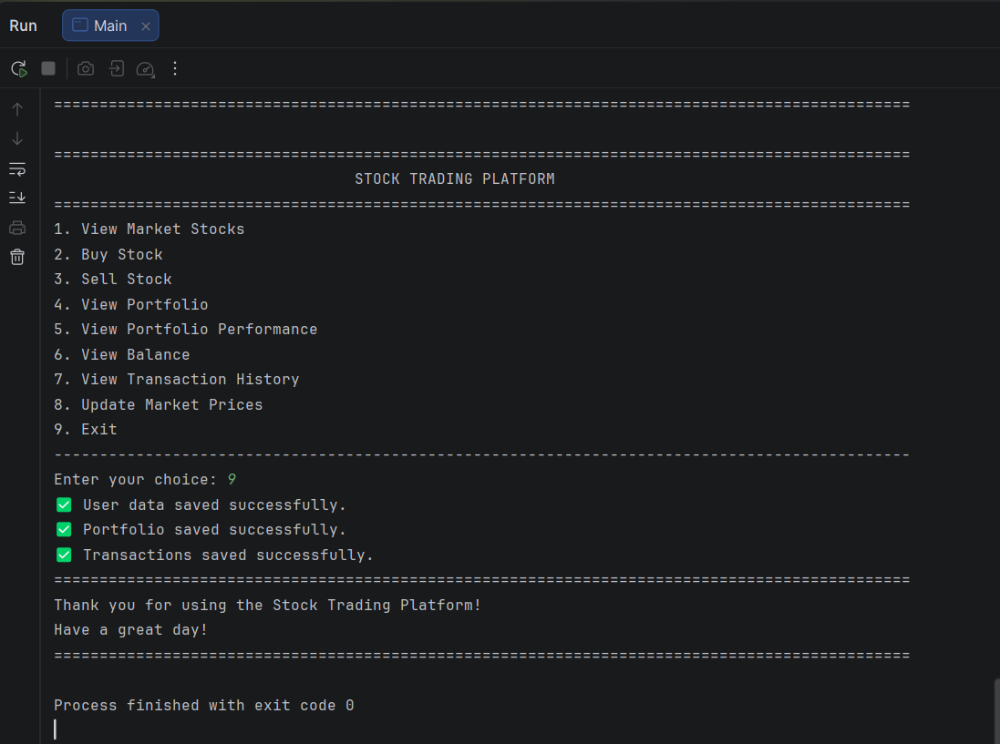

---

## 10. Automatic Data Saving

Shows successful saving of user data before exiting the application.

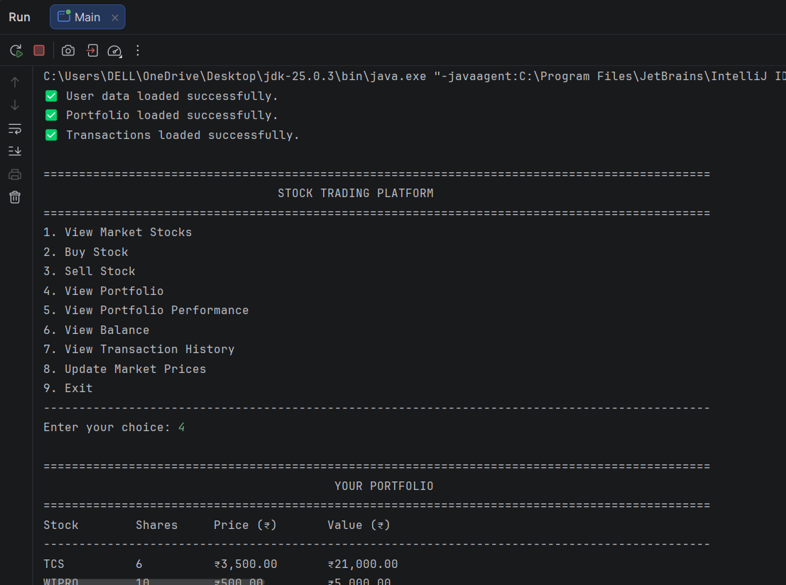

---

## 11. Portfolio After Transactions

Shows the updated portfolio after multiple buy and sell operations.

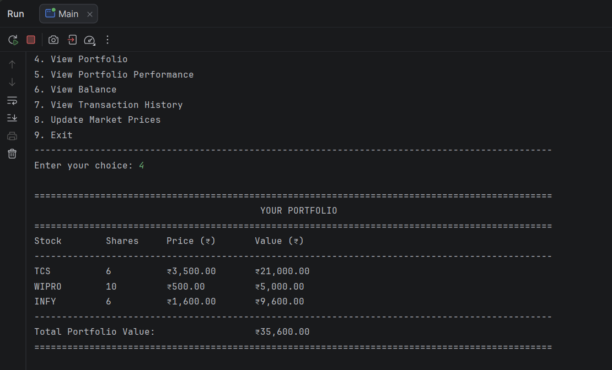


# Sample Console Output

The application provides a clean and structured console interface.

Example:

```text
==============================================================
             STOCK TRADING PLATFORM
==============================================================

1. View Market Stocks
2. Buy Stock
3. Sell Stock
4. View Portfolio
5. View Portfolio Performance
6. View Balance
7. View Transaction History
8. Update Market Prices
9. Exit

--------------------------------------------------------------

Enter your choice:
```

---

# Project Highlights

✔ Clean Object-Oriented Design

✔ Modular Architecture

✔ Professional Console Interface

✔ Persistent Data Storage

✔ Exception Handling

✔ Input Validation

✔ Java Collections Framework

✔ File Handling

✔ Transaction History

✔ Portfolio Performance Analysis

---

# Learning Outcomes

This project demonstrates practical understanding of:

- Java Programming
- Object-Oriented Programming
- Collections Framework
- File Handling
- Exception Handling
- Console Application Development
- Modular Software Design
- Git and GitHub Workflow
- Software Documentation

---

# Future Enhancements

Although Version 1.0 is a fully functional stock trading simulation, several enhancements are planned for future releases.

## Version 2.0 Roadmap

- Multi-user support with authentication
- User login and registration system
- Admin dashboard
- Dynamic stock market simulation
- Live stock price integration using APIs
- Portfolio diversification analysis
- Profit/Loss graphs and charts
- Database integration using MySQL
- JavaFX graphical user interface
- Export transaction history to PDF
- Search and filter functionality
- Watchlist feature
- Dividend simulation
- Portfolio analytics dashboard

---

# Learning Outcomes

This project helped strengthen practical knowledge in the following areas:

- Java Programming
- Object-Oriented Programming (OOP)
- Java Collections Framework
- File Handling
- Exception Handling
- Modular Software Design
- Console Application Development
- Git and GitHub
- Software Documentation
- Problem-Solving

---

# Acknowledgements

This project was developed as part of the **CodeAlpha Java Programming Internship**.

The objective of the project was to design and implement a console-based stock trading simulation demonstrating core Java programming concepts and clean software design principles.

---

# Author

**Bhavya Shukla**

Electronics and Communication Engineering Graduate

Java Developer | Software Engineering Enthusiast

---

# License

This project is licensed under the MIT License.

See the `LICENSE` file for complete details.

---

# Repository Status

**Project:** Stock Trading Platform

**Version:** 1.0

**Status:** ✅ Completed

**Internship:** CodeAlpha Java Programming Internship

**Last Updated:** July 2026

---

⭐ If you found this project helpful, consider giving the repository a star.
