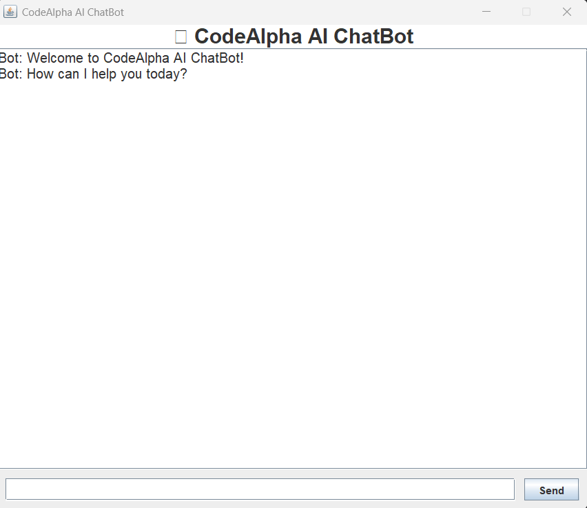
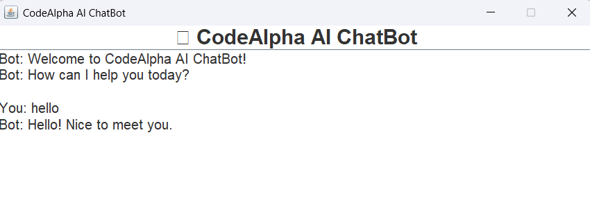
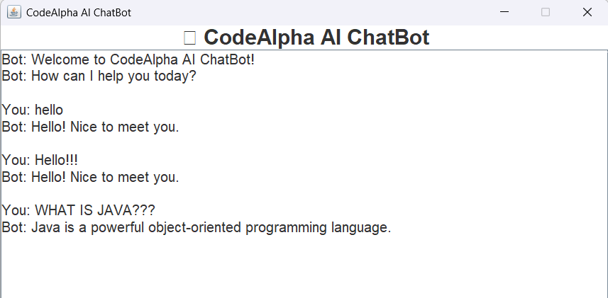
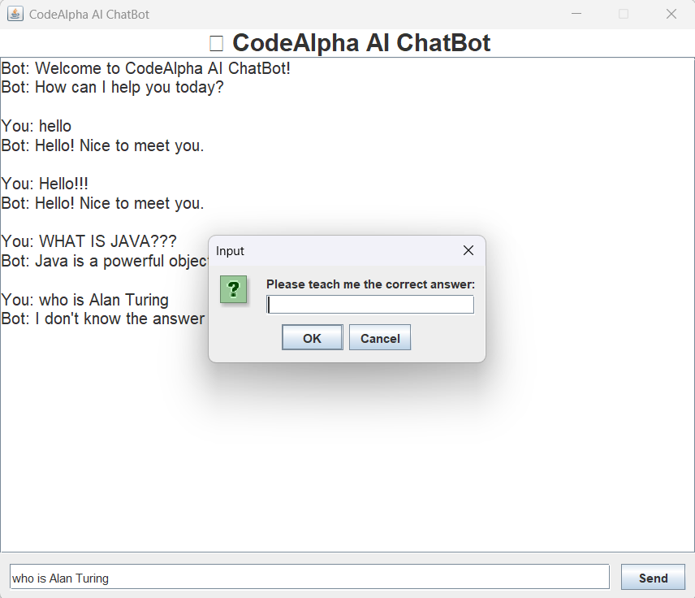
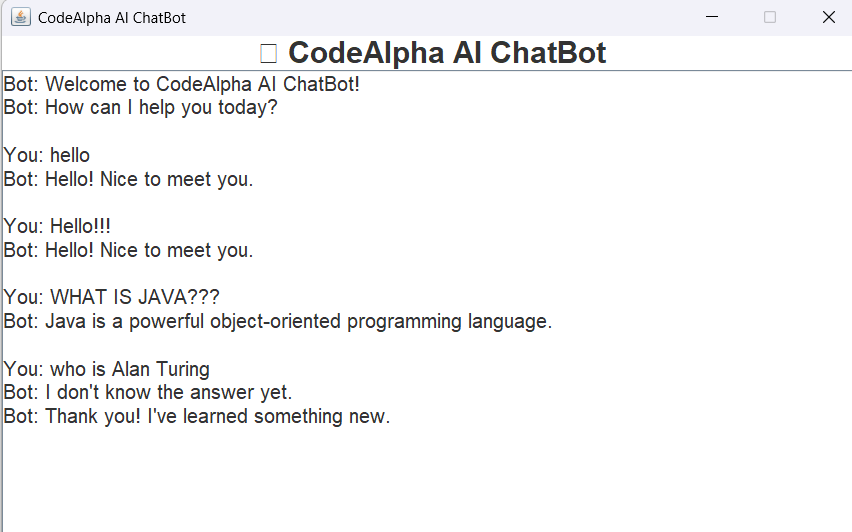
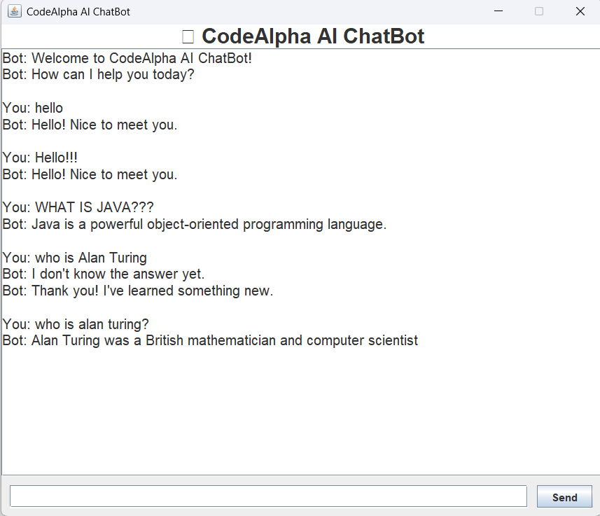
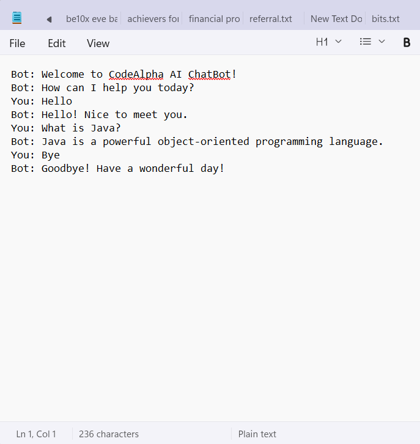

# 🤖 CodeAlpha AI ChatBot

> A Java-based Artificial Intelligence ChatBot developed as **Task 3** for the **CodeAlpha Java Programming Internship
**.

## 📌 Project Overview

CodeAlpha AI ChatBot is a desktop application built using **Java Swing** that allows users to interact with a chatbot
through a graphical user interface.

The chatbot uses **Natural Language Processing (NLP) preprocessing**, a **rule-based response engine**, a **FAQ
knowledge base**, and a **dynamic learning mechanism** to provide intelligent responses. When the chatbot encounters an
unknown question, it can learn a new answer from the user and permanently store it for future conversations.

---

# ✨ Features

- ✅ Java Swing graphical user interface
- ✅ Real-time chatbot interaction
- ✅ Rule-based AI response engine
- ✅ Natural Language Processing (NLP) preprocessing
- ✅ FAQ knowledge base
- ✅ Dynamic learning for unknown questions
- ✅ Persistent knowledge storage
- ✅ Chat history saved to a text file
- ✅ Object-Oriented Programming (OOP) architecture
- ✅ Modular and maintainable code structure

---

# 🧠 NLP Techniques Used

The chatbot performs basic Natural Language Processing before searching the knowledge base.

Current preprocessing includes:

- Converting text to lowercase
- Removing punctuation
- Removing extra spaces
- Normalizing user input

Example:

| User Input     | Processed Input |
|----------------|-----------------|
| Hello!!!       | hello           |
| HOW ARE YOU?   | how are you     |
| What is Java?? | what is java    |

---

# 🏗️ Project Structure

```text
AIChatBot
│
├── src
│   └── chatbot
│       ├── Main.java
│       ├── ChatBotGUI.java
│       ├── ChatBotEngine.java
│       ├── FAQDatabase.java
│       ├── NLPProcessor.java
│       ├── DynamicLearner.java
│       └── ChatHistory.java
│
├── data
│   ├── faq.txt
│   └── chat_history.txt
│
├── screenshots
│
├── README.md
├── CHANGELOG.md
├── LICENSE
└── .gitignore
```

---

# ⚙️ Technologies Used

- Java
- Java Swing
- Object-Oriented Programming
- File Handling
- Collections Framework
- Natural Language Processing (Basic)
- Rule-Based Artificial Intelligence

---

# 🚀 How to Run

1. Clone the repository.

```
git clone <repository-url>
```

2. Open the project in IntelliJ IDEA.

3. Ensure JDK 17 or later is installed.

4. Run:

```
Main.java
```

---

# 💬 Sample Conversation

```
Bot:
Welcome to CodeAlpha AI ChatBot!

You:
Hello

Bot:
Hello! Nice to meet you.

You:
What is Java?

Bot:
Java is a powerful object-oriented programming language.

You:
Who is Virat Kholi?

Bot:
I don't know the answer yet.
Please teach me the correct answer.

You:
Virat kohli is an Indian Cricketer.

Bot:
Thank you! I've learned something new.
```

---

---

# 📸 Screenshots

## Main Application Window



---

## Basic Chat Interaction



---

## NLP Processing



---

## Dynamic Learning



---

## Learning Confirmation



---

## Learned Response



---

## Chat History



# 📁 Data Files

### faq.txt

Stores chatbot questions and answers.

Example:

```
hello=Hello! Nice to meet you.
bye=Goodbye! Have a wonderful day!
```

---

### chat_history.txt

Stores every conversation automatically.

---

# 🏛️ Software Architecture

```
                User
                  │
                  ▼
          ChatBotGUI (Swing)
                  │
                  ▼
          ChatBotEngine
          ┌───────────────┐
          ▼               ▼
   NLPProcessor      FAQDatabase
                          │
                          ▼
                      faq.txt
                          │
                          ▼
                 DynamicLearner
                          │
                          ▼
                      ChatHistory
                          │
                          ▼
                  chat_history.txt
```

---

# 🎯 Learning Outcomes

This project demonstrates practical knowledge of:

- Java Programming
- Swing GUI Development
- Object-Oriented Design
- File Handling
- Collections Framework
- NLP Preprocessing
- Rule-Based AI
- Software Architecture
- Modular Programming

---

# 🔮 Future Improvements (Version 2)

The following enhancements are planned after the internship submission:

- Modern user interface
- Dark mode
- Chat bubbles
- Better NLP matching
- Export chat
- Menu bar
- Session statistics
- Enhanced AI responses

---

# 👩‍💻 Author

**Bhavya Shukla**

CodeAlpha Java Programming Internship

---

# 📄 License

This project is licensed under the MIT License.